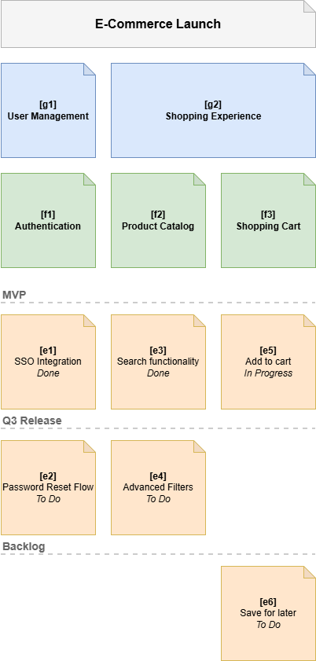
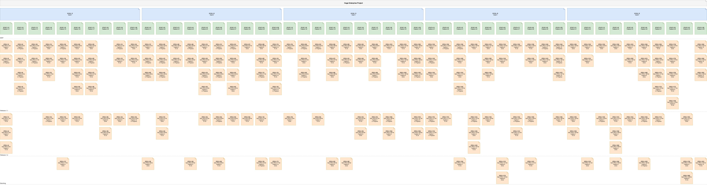

# Story Map Generator

The Story Map Generator is a command-line tool that takes a hierarchical definition of an agile Story Map written in YAML and automatically generates a visually structured, clickable `.drawio` diagram.

## Features

* **Docs-as-Code Approach**: Maintain your product backlog and story maps in source control using simple YAML.
* **Automated Layout Engine**: Automatically calculates grid coordinates, placing Goals and Features as a horizontal backbone, and organizing Epics vertically into their respective Release swimlanes.
* **Visual Status Indicators**: Displays the status text directly on the Epic cards.
* **Interactive Diagrams**: Supports clickable URLs on cards (e.g., linking directly to a Jira or GitHub issue).




## Architecture

The project follows a **Ports and Adapters** architecture to decouple the core domain logic from input parsing and output rendering:
1.  **YAML Parser Adapter**: Ingests deeply nested YAML and strictly validates it.
2.  **Core Domain**: A strictly typed Python domain model representing the Story Map hierarchy (`Workspace -> Map -> Goal -> Feature -> Epic`).
3.  **Layout Engine**: Calculates `(x, y)` coordinates, widths, and heights for every node based on the grid and swimlane constraints.
4.  **Draw.io Renderer Adapter**: Generates the raw Draw.io XML structure (`.drawio`), applying colors, geometries, and links.

*(For detailed architectural and domain models, see the `docs/` folder.)*

## Installation

1. Clone this repository.
2. Ensure you have Python 3.8+ installed.
3. Create a virtual environment and install the dependencies:

```bash
python3 -m venv venv
source venv/bin/activate
pip install -r requirements.txt
```

## Usage

Run the CLI tool by passing an input YAML file.

```bash
# Generate a diagram from the sample file
python src/cli.py --input sample.yaml

# Specify a custom output file name
python src/cli.py --input sample.yaml --output my_product_map.drawio
```

The resulting `.drawio` file can be opened directly in [diagrams.net (Draw.io)](https://app.diagrams.net/) or its desktop client.

## Theme Configuration

You can customize the visual appearance (colors, card sizes, and padding) of your generated Story Map by passing a custom theme YAML file using the `--theme` or `-t` flag:

```bash
python src/cli.py --input sample.yaml --theme my_dark_theme.yaml
```

Alternatively, you can define a `theme:` block directly in the root of your Story Map YAML file.

```yaml
theme:
  card_width: 150
  card_height: 100
  color_epic: "#ffcccc"
maps:
  - id: m1
    title: "My Map"
    # ...
```

For more details on styling rules, check the [Styling Documentation](docs/styling.md).

## YAML Structure Example

The tool expects a strictly defined hierarchy. For a full breakdown of all required and optional fields, defaults, and the rules governing swimlane logic (including the "Unassigned" default), please refer to the [YAML Schema Documentation](docs/schema.md).

Here is a simplified example of the supported structure:

```yaml
maps:
  - id: m1
    title: "E-Commerce Launch"
    releases: ["MVP", "Q3 Release", "Backlog"]
    goals:
      - id: g1
        title: "User Management"
        features:
          - id: f1
            title: "Authentication"
            status: "In Progress"
            epics:
              - id: e1
                title: "SSO Integration"
                status: "Done"
                url: "https://jira.company.com/browse/PROJ-1"
                release: "MVP"
              - id: e2
                title: "Password Reset Flow"
                status: "To Do"
                url: "https://jira.company.com/browse/PROJ-2"
                release: "Q3 Release"
```

### Hierarchy Levels
*   **Level 0 (Map)**: The root container holding the title and the defined release swimlanes.
*   **Level 1 (Goal)**: The top-level categories of the application backbone.
*   **Level 2 (Feature)**: Sub-categories of goals, forming the columns of the map.
*   **Level 3 (Epic)**: The executable units of work that drop down into the swimlanes.

## Running Tests

To run the unit tests, use `pytest`:

```bash
PYTHONPATH=. pytest
```

# Future Outlook
* Jira Importer: Use a Jira Issue structure to render Maps
* Compare Story maps (that got modified manually)
